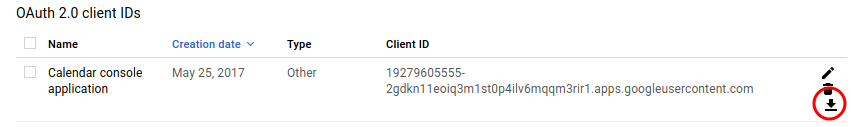

# Google Cloud Platform C++ Samples

A collection of samples that demonstrate how to call some
Google Cloud services from C++.

## Prerequisites

See the instructions in the root [README](../../README.md) to build.

Before calling a Google API, you must create a Google Cloud project and enable
billing.

1.  **Create a project in the Google Cloud Platform Console**.
    If you haven't already created a project, create one now. Projects enable
    you to manage all Google Cloud Platform resources for your app, including
    deployment, access control, billing, and services.
    1.  Open the [Cloud Platform Console](https://console.cloud.google.com/).
    2.  In the drop-down menu at the top, select **Create a project**.
    4.  Give your project a name.
    5.  Make a note of the project ID, which might be different from the project
        name. The project ID is used in commands and in configurations.

2.  **Enable billing for your project**.
    If you haven't already enabled billing for your project,
    [enable billing now](https://console.cloud.google.com/project/_/settings).
    Enabling billing allows the application to consume billable resources such
    as running instances and storing data.

## Running the Google Cloud Storage Sample

The Cloud Storage sample uses [Service Account](
    https://developers.google.com/identity/protocols/OAuth2ServiceAccount)
credentials to authenticate with the Cloud Storage API.

1.  **Enable APIs.**

    [Click here](
        https://console.cloud.google.com/flows/enableapi?apiid=storage-component.googleapis.com&showconfirmation=true)
    to enable the Google Cloud Storage API for your project.

2.  **Download credentials**.

    1.  [Visit the API Manager Dashboard](https://console.cloud.google.com/apis/dashboard)
        and click **Credentials** in the left navigation.  

    2.  Click **Create credentials** and choose **Service Account key**.

    3.  Under Service account, choose **Compute Engine default service
        account**, and leave **JSON** selected under Key Type.  Click
        **Create**.  A .json file will be downloaded to your computer.

3.  **Run storage_sample**.

    Pass the path of the .json file you downloaded to the storage_sample:

        $ bin/storage_sample path/to/service_account.json
        https://www.googleapis.com/storage/v1/b/1gallon
        https://www.googleapis.com/storage/v1/b/2gallon
        https://www.googleapis.com/storage/v1/b/5gallon
        Done!    

## Running the Google Calendar Sample

The calendar sample uses 3-legged authentication.  The 3 parties are Google,
you (your Google Cloud Project), and the user.

1.  **Enable APIs.**

    1. Visit the [Google Cloud Console API Manager](
        https://console.cloud.google.com/apis).

    2. Under **G Suite APIs**, click **Calendar API**.

    3. Click **Enable** to enable the Google Calendar API.


2.  **Download credentials**.

    1. Visit the [Google Cloud Console Credentials page](
        https://console.cloud.google.com/apis/credentials).

    2. Click **Create credentials**.

    3. Choose **OAuth client ID**.

    4. For Application type, choose **Other**.

    5. For Name, type **Calendar console application**.

    6. Click **Create**.

    7. The Google Cloud Console will display your client ID and client secret
       in a window.  Click **OK** to close the window.

    8. You should now see `Calendar console application` listed under
       **Oauth 2.0 client IDs**.  Click the down arrow icon to download a
       client secret file.  
       
       

3.  **Run calendar_sample**.

    Pass the client secret file path to `calendar_sample`.

    ```
    $ bin/calendar_sample path/to/client_secret.json
    SAMPLE:  Getting User Authorization

    Welcome to the Google APIs for C++ CalendarSample.
    You will need to authorize this program to look at your calendar.
    If you would like to save these credentials between runs
    (or restore from an earlier run) then enter a Google Email Address.
    Otherwise just press return.

    Address: [PRESS ENTER]
    Enter the following URL into a browser:
    https://accounts.google.com/o/oauth2/auth?client_id=xyz.apps.googleusercontent.com&redirect_uri=urn%3Aietf%3Awg%3Aoauth%3A2.0%3Aoob&scope=https%3A%2F%2Fwww.googleapis.com%2Fauth%2Fcalendar&response_type=code

    Enter the browser's response to confirm authorization: 4/XXXXXXXXXXXXXXXXXXXXXXXXXXXXXXXXXXXXXXXXXXX
    Authorized 

    SAMPLE:  Showing Initial Calendars
    ====  CalendarList  ====
    CalendarListEntry
        ID: XXX@gmail.com
        Summary:XXX@gmail.com

    CalendarListEntry
        ID: YYY@gmail.com
        Summary: YYY@gmail.com


    SAMPLE:  Adding Calendar
    Added new calendar ID=google.com_8537hv9v85d50m5jtct09u4ndo@group.calendar.google.com:
    Calendar
        ID: google.com_8537hv9v85d50m5jtct09u4ndo@group.calendar.google.com
        Summary: Calendar added by CalendarSample
    ...

    Done!
    ```    

## Licensing

* See [LICENSE](../../COPYING.txt)
